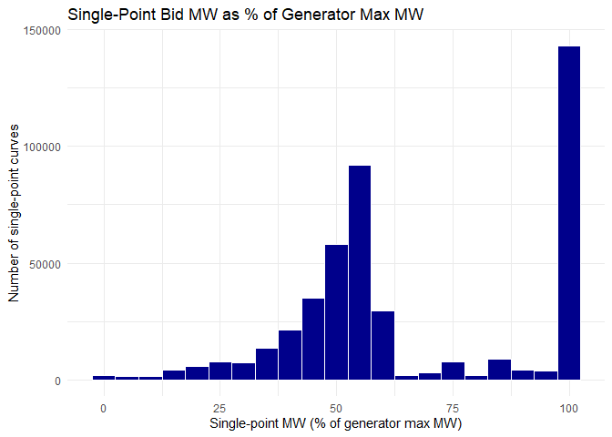

# Single Point Bid Curve Numbers
Nicole, Sumanth, and Visruth

# Single Point Curves

    [1] 582849

# Single Point Curves with nonnull x and y

    [1] 452964

# Number of unique generators which submitted single point curves

    [1] 250

Total number of generators:

    [1] 4191

    [1] 5.965163

# Single-point curves at each generator’s global max MW

    # A tibble: 1 × 3
      n_single_point_curves n_single_point_at_generator_max pct_single_point_at_ge…¹
                      <int>                           <dbl>                    <dbl>
    1                452964                           87010                     19.2
    # ℹ abbreviated name: ¹​pct_single_point_at_generator_max

# Distribution of single-point bids as percent of generator max MW

    Saving 7 x 5 in image

# Single-point curves by hour

    Saving 7 x 5 in image
